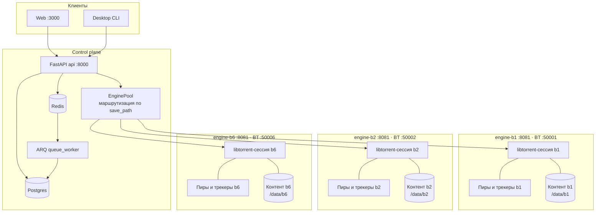

# Архитектура: платформа раздачи торрентов

> Назначение: сервис **раздаёт (сидирует)** торренты через libtorrent — реальная сессия,
> пиры, трекеры, DHT. Создание `.torrent` из контента — отдельная задача и здесь не делается.

Актуально на: июнь 2026 (после фаз 0–2, multi-engine на CT 400).

---

## 1. Что это и как работает простыми словами

1. Пользователь в **вебе** (или десктоп-CLI) отправляет команду: добавить торрент
   (magnet / `.torrent`-файл / URL на `.torrent`), пауза, старт, удаление, лимиты, трекеры.
2. **API** (FastAPI) валидирует запрос, пишет в **БД** то, что должно пережить перезапуск
   (какой торрент, где хранить, метка, желаемый статус), и передаёт команду нужному **движку**.
3. **Движок** держит **libtorrent** и реально общается с сетью и диском: качает метаданные,
   проверяет хэш, раздаёт пирами, анонсит трекерам.
4. Состояние для UI снова отдаёт **API**: он опрашивает движок (runtime-снапшот) и
   агрегирует с данными БД.

Ключевой принцип разделения: **БД хранит «намерение» (intent), движок хранит «факт» (runtime)**.
Движок сам в БД не ходит. После рестарта контейнеров память движка пуста — **API при старте
восстанавливает раздачи** из БД (см. §6).

---

## 2. Компоненты

| Компонент | Технологии | Роль |
|-----------|-----------|------|
| `web/` | Vite + TypeScript, nginx | Браузерный клиент; nginx проксирует `/api` → `api` |
| `desktop/` | Python CLI `seeding-desktop` | Клиент для Windows (GUI — позже) |
| `api/` | FastAPI, SQLAlchemy async | Публичный HTTP, оркестрация, восстановление, агрегация |
| `engine/` | Python + libtorrent | Сессия раздачи, внутренний HTTP API (:8081) |
| `db/` | SQLAlchemy + Alembic | Модели, миграции, репозитории — единственный владелец схемы |
| `queue/` | ARQ + Redis | Фоновые задачи (sync runtime→БД, restore, bulk-register) |

Границы (правило «без лапши»):
- Бизнес-логика раздачи — только в `engine/`. API лишь оркестрирует и отдаёт состояние.
- Схема БД — только в `db/`; остальные модули импортируют модели/репозитории оттуда.
- Очередь — только в `queue/`; API ставит задачи, но не реализует воркеры внутри себя.
- Клиенты (`web/`, `desktop/`) не ходят в БД и не импортируют `engine/` — только публичный API.

---

## 3. Multi-engine (CT 400)

Чтобы раскладывать раздачи по разным дискам/каталогам, поднимается **несколько процессов
libtorrent** — по одному движку на «корзину» хранения `b1…b6`. Каждый движок — отдельный
контейнер со своим томом, своим BitTorrent-портом и своей сессией.



> Каждый движок — **самостоятельный узел раздачи**: своя сессия libtorrent, свой набор
> пиров/трекеров (DHT, соединения), свой BitTorrent-порт и **собственное хранилище контента**
> (`/data/bX`, отдельный том/диск). Движки между собой не делят ни сессию, ни данные — общий
> у них только control plane (API/БД/очередь). Это позволяет раскладывать раздачи по разным
> дискам, а в перспективе — выносить движки на отдельные машины (см. [`ROADMAP.md`](ROADMAP.md),
> фазы 4.5/4.6).

**Маршрутизация (`EnginePool`).** В БД у каждой раздачи есть `engine_id` и `save_path`.
API выбирает движок по совпадению `save_path` с `storage_prefix` движка из конфига
`config/engines.ct400.json`:

```json
[
  { "id": "b1", "url": "http://engine-b1:8081", "storage_prefix": "/data/b1", "listen_port": 50001 }
]
```

Глобальные операции (общая статистика, лимиты сессии, restore-all) идут «веером» по всем
движкам и агрегируются в API (`EnginePool.aggregate_session_stats`).

---

## 4. Модель хранения

Внутри каждого движка `SEEDING_DATA_ROOT=/data`. На CT 400 том движка `bX` смонтирован с
хоста: `/mnt/media/seeding-test/bX → /data`. `save_path` раздачи = `storage_prefix` = `/data/bX`.

| Путь в контейнере | Хост (CT 400, b1) | Что лежит |
|-------------------|-------------------|-----------|
| `/data/bX/<name>/…` | `/mnt/media/seeding-test/b1/b1/<name>/…` | контент раздач |
| `/data/.fastresume/<db_id>.fastresume` | `…/b1/.fastresume/` | быстрое возобновление без рехэша |
| `/data/.torrents/<db_id>.torrent` | `…/b1/.torrents/` | сохранённые `.torrent` (для restore с диска) |
| `/data/.state/session.state` | `…/b1/.state/` | состояние сессии libtorrent |

> Тонкость: `save_path=/data/b1` внутри контейнера, где сам `/data` — это уже `…/seeding-test/b1`,
> поэтому контент на хосте оказывается в `…/seeding-test/b1/b1/<name>`. Это намеренно и
> консистентно; важно не передавать относительный `save_path` (без ведущего `/`) — он не
> сматчит префикс и уедет в дефолтный движок.

**Данные, которые должны жить вне слоя контейнера:** контент раздач, том Postgres,
`.fastresume`/`.torrents`/`.state` — иначе теряются при пересборке образов.

---

## 5. Поток данных по основным операциям

**Добавление (magnet / файл / URL):**
`web → POST /api/v1/torrents | /upload | /url` → API пишет строку в БД (status, save_path,
engine_id, label) → `EnginePool` → `engine.add_torrent()` → libtorrent добавляет торрент
(`auto_managed=False`, ручное управление) → сохраняется `.torrent` и fastresume.

**Пауза / старт:** API → движок `pause()/resume()` (снимает `auto_managed`, чтобы пауза
«прилипала») → БД-статус приводится к факту через `sync-runtime`.

**Состояние для списка/детали:** API на каждый запрос берёт runtime-снапшот у движка
(имя, размер, прогресс, ↓/↑, отдано, пиры/сиды, ratio, ETA, added, лимиты, файлы, трекеры)
и объединяет с БД.

**Синхронизация БД←runtime:** задача `sync_runtime_to_db` (через `/jobs/sync-runtime` или
ARQ-крон) переносит фактический статус движка в БД (`status_from_runtime`).

---

## 6. Восстановление после рестарта (важно)

После перезапуска контейнеров память движков пуста. **API в lifespan** (`api/seeding_api/restore.py`,
флаг `SEEDING_ENGINE_RESTORE`) читает БД и заново поднимает раздачи в движках, параллельно по
`engine_id` (`SEEDING_RESTORE_CONCURRENCY`):
- magnet-строки — `register`,
- файловые раздачи — `restore_from_disk` по сохранённому `.torrent`,
- затем синхронизирует паузу с желаемым статусом из БД.

**Корневой фикс «после рестарта часть раздач в паузе» (фаза 2):**
причина была не в race-условии, а в том, что libtorrent добавлял торренты как `auto_managed`
и его авто-менеджер ставил сиды на паузу сверх лимитов `active_seeds/active_limit`. Решение:
- движок задаёт **неограниченные** `active_seeds / active_downloads / active_limit = -1`
  и `dont_count_slow_torrents` (env `LT_ACTIVE_*`, дефолт — без лимита);
- торренты добавляются с `auto_managed=False`, `pause()/resume()` снимают авто-флаг —
  ручное управление авторитетно;
- `restore.py` дополнительно авто-резюмит готовые сиды (страховка);
- `status_from_runtime` отдаёт статус **честно** (paused = paused), без подмены на seeding.

Проверено: полный рестарт api + 6 движков → 21/21 раздача поднимается `seeding`, ручная
пауза держится через цикл синхронизации.

---

## 7. Публичный API (`/api/v1`)

| Метод | Путь | Назначение |
|-------|------|-----------|
| GET | `/health` | здоровье API + всех движков |
| GET | `/engines` | список движков и их статус |
| GET | `/torrents` | список раздач (с runtime) |
| POST | `/torrents` | добавить по magnet |
| POST | `/torrents/upload` | добавить `.torrent`-файлом (multipart) |
| POST | `/torrents/url` | добавить по URL на `.torrent` |
| GET | `/torrents/{id}` | детали + runtime |
| PATCH | `/torrents/{id}` | изменить (метка и пр.) |
| DELETE | `/torrents/{id}` | удалить (опц. с файлами) |
| POST | `/torrents/{id}/pause` · `/resume` | пауза / старт |
| POST | `/torrents/{id}/recheck` · `/reannounce` | рехэш / переанонс |
| POST | `/torrents/{id}/limits` | per-torrent лимиты ↓/↑ |
| GET/POST/DELETE | `/torrents/{id}/trackers` | список / добавить / удалить трекер |
| GET/POST | `/torrents/{id}/files` · `/files/priorities` | файлы и приоритеты |
| POST | `/torrents/bulk/pause` · `/resume` · `/delete` | массовые операции |
| GET | `/labels` | список меток |
| GET | `/session/stats` | агрегированная статистика по всем движкам |
| POST | `/session/limits` | глобальные лимиты сессии |
| POST | `/jobs/*` | постановка фоновых задач (sync, restore, health, bulk-register) |

Внутренний API движка (`:8081`, не публичный) зеркалит торрент-операции на уровне `db_id`
плюс `/health`, `/session/stats`, `/session/limits`.

---

## 8. Конфигурация (env)

**API:** `DATABASE_URL`, `REDIS_URL`, `ENGINES_CONFIG_FILE` (путь к engines.json),
`SEEDING_RESTORE_CONCURRENCY`, `SEEDING_ENGINE_RESTORE`, `SEEDING_API_KEYS` (+ заголовок
`X-API-Key`), `SEEDING_REQUIRE_ENGINE_FOR_DELETE`.

**Движок:** `ENGINE_HTTP_PORT=8081`, `SEEDING_ENGINE_BACKEND=libtorrent`, `SEEDING_DATA_ROOT=/data`,
`ENGINE_STORAGE_SUBDIR=bX`, `SEEDING_LT_STATE_FILE`, `SEEDING_FASTRESUME_DIR`,
`LT_LISTEN_INTERFACES`, `LT_CONNECTIONS_LIMIT`, `LT_ENABLE_DHT/LSD/UPNP/NATPMP`,
`LT_DOWNLOAD/UPLOAD_RATE_LIMIT_BPS`, `LT_ACTIVE_SEEDS/ACTIVE_DOWNLOADS/ACTIVE_LIMIT`,
`LT_DONT_COUNT_SLOW`.

---

## 9. Деплой и эксплуатация (CT 400)

- Стек: Postgres, Redis, `api` (:8000), `queue_worker`, `web` (:3000), `engine-b1…b6`
  (:8081 внутр., BitTorrent :50001…50006).
- Запуск:
  `docker compose -f docker-compose.multi-engine.yml -f docker-compose.multi-engine.media.yml up -d --build`
- Миграции: `api` при старте выполняет `alembic upgrade head`.
- Применение изменений кода: образы собираются на этапе build, поэтому нужен
  `… build <service>` + `… up -d <service>`. Web можно пересобирать независимо (не трогает раздачи).
- Файрвол для внешнего доступа: 8000, 3000 и BitTorrent-порты 50001–50006 (tcp+udp).

**Точки риска:** консистентность путей `save_path` ↔ префикс движка; данные/том БД вне
слоя контейнера; graceful shutdown движка (сохранение fastresume/session.state).

---

## 10. Карта репозитория

```
api/        FastAPI: routers (torrents, session, jobs), engine_pool, restore, schemas
engine/     libtorrent runtime, внутренний HTTP, fastresume_io, store
db/         модели (TorrentRecord, TorrentStatus), alembic, репозитории, status_from_runtime
queue/      ARQ-задачи (sync_runtime_to_db, restore, bulk-register)
web/        TS-клиент (список/детали, фильтры/сортировка/bulk, файлы/трекеры/лимиты)
desktop/    CLI seeding-desktop
config/     engines.*.json (реестр движков)
docs/       ROADMAP, MULTI_ENGINE, INTEGRATION, QA, отчёты
scripts/    dev.ps1 / dev.sh (up/down/status/sync/test)
docker-compose*.yml   базовый, multi-engine, media-override
```

См. также: [`ROADMAP.md`](ROADMAP.md), [`docs/MULTI_ENGINE.md`](docs/MULTI_ENGINE.md),
[`docs/INTEGRATION.md`](docs/INTEGRATION.md), [`README.md`](README.md).
