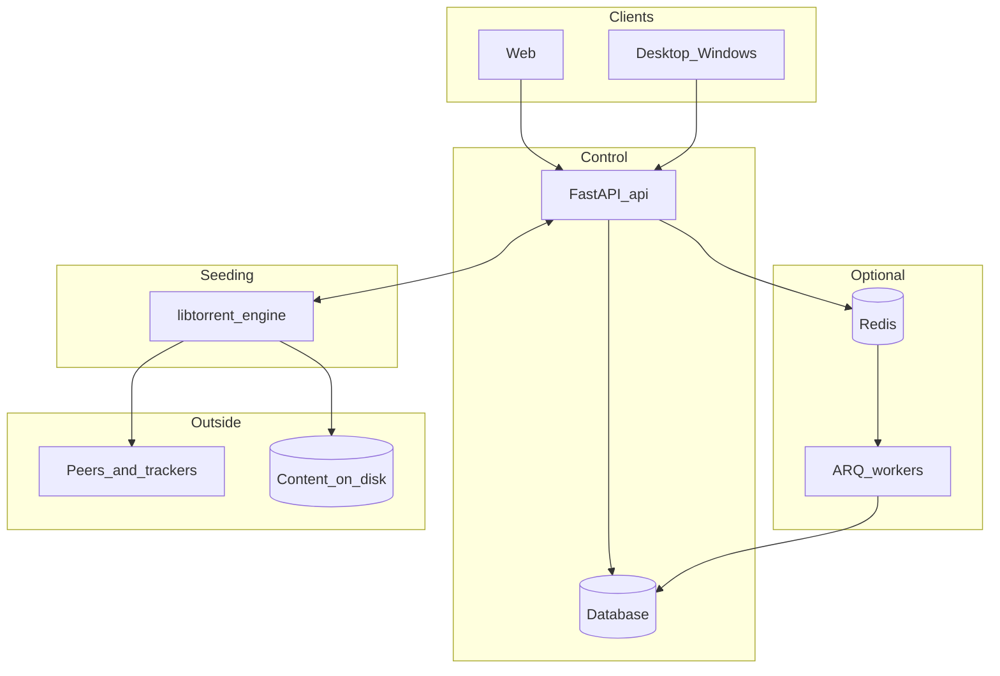

# Архитектура: платформа раздачи торрентов

## Назначение

Сервис **раздаёт** торренты (libtorrent, сессия, пиры, трекеры, DHT). **Создание** `.torrent` из контента — отдельный сценарий (в репозитории может быть другой проект).

## Простыми словами

1. Пользователь в **вебе** или **десктопе** отправляет команду (добавить торрент, пауза и т.д.).
2. **API** проверяет запрос, пишет в **БД** то, что должно пережить перезапуск, и передаёт команду **движку**.
3. **Движок** держит **libtorrent** и реально общается с сетью и диском.
4. Состояние для UI снова отдаёт **API** (опрос или push — по решению агента API/веб).

После рестарта контейнеров память движка пустая. **Восстановление рантайма** выполняет **API** при своём старте (lifespan): читает БД и снова вызывает движок (`register` / синхронизация паузы), см. `api/seeding_api/restore.py` и `SEEDING_ENGINE_RESTORE`. Движок сам БД не читает.

## Компоненты

| Компонент | Роль |
|-----------|------|
| `web/` | Браузерный клиент |
| `desktop/` | Клиент Windows |
| `api/` | FastAPI, публичный HTTP |
| `engine/` | Процесс libtorrent |
| `db/` | Модели, миграции Alembic |
| `queue/` | ARQ + Redis, фоновые задачи |

## Диаграмма

## Multi-engine

Несколько libtorrent-процессов (по HDD b1–b6): реестр движков, `engine_id` в БД, `EnginePool` в API. CT 400: `docker-compose.multi-engine.yml`. Подробно — [`docs/MULTI_ENGINE.md`](docs/MULTI_ENGINE.md).

## Деплой

- **По умолчанию:** [Docker Compose](https://docs.docker.com/compose/) на одном хосте — это не Kubernetes, а удобная сборка нескольких контейнеров, сеть и тома.
- **CT 400 / 6 движков:** `docker compose -f docker-compose.multi-engine.yml up -d`
- **Тома:** каталог данных торрентов и файлы БД (или том Postgres) должны жить **вне** слоя контейнера, чтобы не терять при пересборке.
- **BitTorrent:** UDP и много соединений; порты прописываются явно в `docker-compose.yml`.
- **Альтернатива:** Ubuntu + systemd без Docker — кратко допустима для отладки диска/сети на «голом» железе.

## Риски

- Корректный **graceful shutdown** движка; опционально файл сессии libtorrent (`SEEDING_LT_STATE_FILE` в `engine/README.md`), per-torrent fastresume — в планах.
- Согласованность **путей** к файлам в БД и внутри контейнера движка.
- При разделении контейнеров — выбор **Postgres** вместо общего SQLite на сетевой диск (см. `docs/INTEGRATION.md`).

## Ссылки (документация библиотек)

- FastAPI: Context7 `/fastapi/fastapi`
- ARQ: Context7 `/python-arq/arq`
