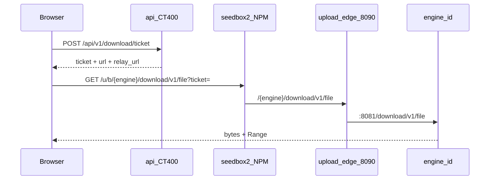
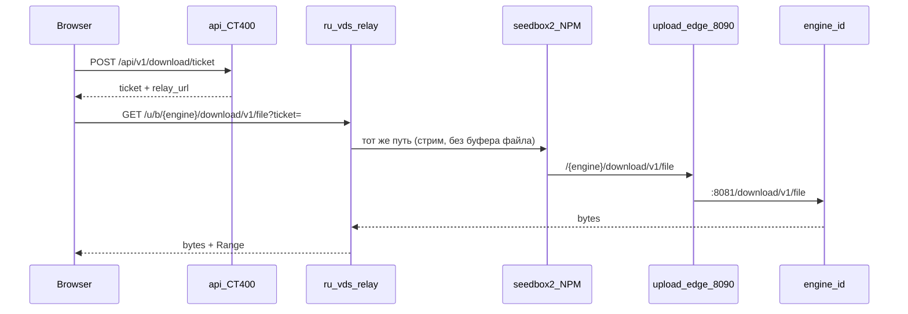

# Прямое скачивание файла с движка

> Внедрено. Зеркало заливки: байты **не** идут через CT400.
> Заливка: [`FILE_UPLOAD.md`](FILE_UPLOAD.md). Unchoke сюда не относится.

Скачать один файл раздачи с тома движка (`/data`). Публично — тот же
вход, что заливка (`/u/b/`, `/u/a/`), плюс тот же **RU VDS** релей.
`/internal/v1` наружу не открываем.

## Решения

| Тема | Решение |
|------|---------|
| Что качаем | Один файл раздачи (не zip пачки в v1) |
| Откуда | Том этого движка, тот же `content_file_path`, что у переноса |
| Когда можно | Файл на диске есть и размер > 0; неполный — можно, браузер докачает Range |
| UX | Деталь → Файлы: «Скачать» и «через RU» |
| Публичный вход | NPM `/u/b/` → 171:8090, `/u/a/` → 243:8090 (**не менять**) |
| Маршрут | `/{engine_id}/download/v1/file` |
| Внутренний API | Не публикуем. Edge: `/download/v1` + уже разрешённые `/upload/v1`, `/health` |
| Auth | HMAC download-ticket от API; `eng` + `tid` + `path` + срок |
| Прямой путь | seedbox2, как заливка |
| Через RU | тот же ticket, база `185-185-143-207.sslip.io/u/{a\|b}` → upload-relay → seedbox2 |
| Права | operator+ (как заливка и управление раздачей) |
| Докачка | `Range` / `206`, как `content-file` |
| Откат | флаг `SEEDING_DOWNLOAD_ENABLED=0` на api; edge можно оставить |

## Потоки

### Прямо (дом / seedbox2)



### Через RU VDS

Клиент в РФ, seedbox2 режется, либо явный пункт «через RU».



Почему не CT400: гигабайты не должны идти лишним хопом через control plane.
Почему не `:8081` наружу: там `/internal/v1` и токен оркестратора.
Почему RU отдельно: заливка уже так обходит блок seedbox2; скачивание — тот же вход.

## Контракт

### API (CT400)

`POST /api/v1/download/ticket` — operator+.

Тело: `{ "torrent_id": 12041, "path": "Season 1/e01.mkv" }`

Ответ:

```json
{
  "ticket": "…",
  "url": "https://seedbox2.hw-s.ru/u/b/b6/download/v1/file",
  "relay_url": "https://185-185-143-207.sslip.io/u/b/b6/download/v1/file",
  "filename": "e01.mkv",
  "size": 1234567890,
  "expires_in": 300
}
```

`path` — как в списке файлов раздачи (относительный). Ticket живёт ~5 минут,
привязан к `engine_id` + `torrent_id` + `path`. Секрет тот же
`SEEDING_UPLOAD_TICKET_SECRET` (или отдельный `SEEDING_DOWNLOAD_TICKET_SECRET`
с тем же значением).

### Движок

`GET /download/v1/file?ticket=&…` (+ заголовок `Range`).

Проверяет HMAC, что файл лежит в `save_path` этой раздачи (без `..`),
стримит с диска. `Content-Disposition: attachment`. Не монтируем это
на `/internal/v1`.

Уже есть внутренний близнец: `GET /internal/v1/torrents/{id}/content-file`.
Публичный роут — тонкая обёртка с ticket вместо `X-Engine-Token`.

### Edge (171 / 243)

В `upload-edge` nginx добавить location `/{engine}/download/v1/` →
`{id}-seeding:8081`. Не открывать `/internal/v1`.

### RU VDS

Сегодня релей — путь **записи** (чанки заливки). Для скачивания нужен
**GET-стрим** в обратную сторону на том же хосте и тех же `/u/a/`, `/u/b/`:

- Caddy `:8445` (h1/h2, без HTTP/3) — как заливка;
- релей не буферит файл целиком, пробрасывает `Range` / `206`;
- апстрим без смены: `seedbox2.hw-s.ru/u/{a|b}/…`.

NPM-локации не трогаем.

## UI

Деталь раздачи → спойлер **Файлы**. Колонка «Скачать» справа от приоритета,
в стиле соседних `btn btn--sm`:

- файл готов (≈100%) — две кнопки `btn btn--sm` в одну строку: «Скачать» и «Через RU»;
- обе одного вида; `td` остаётся ячейкой таблицы (flex только внутри);
- качается — кнопки неактивны, подсказка «файл ещё качается»;
- viewer — колонки нет.

Одна раздача целиком zip — не в этой версии.

Поток в браузере: ticket → `window.open` / `<a download>` на `url` или
`relay_url` с `?ticket=`. Прогресс пишет сам браузер (обычное сохранение).

## Выкат (порядок)

1. **Спека** — этот файл.
2. **Движок** — `/download/v1` + тесты ticket / path-escape / Range.
   Пересборка b1–b6 и a1–a3 (как unchoke: точечно, без `git reset --hard`).
   После recreate обязательно сеть `seeding-upload`: оверлей
   `docker-compose.engine.upload.yml` на b* и `scripts/upload-edge-attach.sh`
   на a* (иначе edge даёт 502 на upload и download).
3. **Edge** — location download на 171 и 243. `:8090` тот же.
4. **RU релей** — GET-стрим на `185.185.143.207`. Смоук: Range 0–1 с дома и
   через sslip.io.
5. **API + web** — ticket, две URL, колонка в Файлах. CT400
   `deploy-ct400.sh up -d --build api web`. Движки уже живые.
6. **Приёмка** — готовый файл с b* и a*, докачка Range, viewer без кнопки,
   просроченный ticket 403, `../` 400, через RU тот же файл.

## Env

```bash
# api (CT400) — дефолт вкл.
SEEDING_DOWNLOAD_ENABLED=1
SEEDING_DOWNLOAD_TICKET_TTL=300
# секрет тот же, что у заливки; отдельный не обязателен
# SEEDING_DOWNLOAD_TICKET_SECRET=<same as upload>
SEEDING_UPLOAD_TICKET_SECRET=<shared>
SEEDING_UPLOAD_PER_ENGINE=1
SEEDING_UPLOAD_BASE_URLS={…}
SEEDING_UPLOAD_RELAY_BASE_URLS={…}

# engine — тот же секрет, что заливка
SEEDING_UPLOAD_TICKET_SECRET=<same>
```

Откат: `SEEDING_DOWNLOAD_ENABLED=0`, перезапуск api. Кнопки пропадут,
`POST /download/ticket` → 404. Движки и edge можно не откатывать.

## Не делаем

- Sidecar на `:8090` (его сняли у заливки).
- Прокси всего `:8081`.
- Качать через `api:8000`.
- Zip всей раздачи в v1.
- Отдельный секрет, если upload-secret уже на всех движках.
