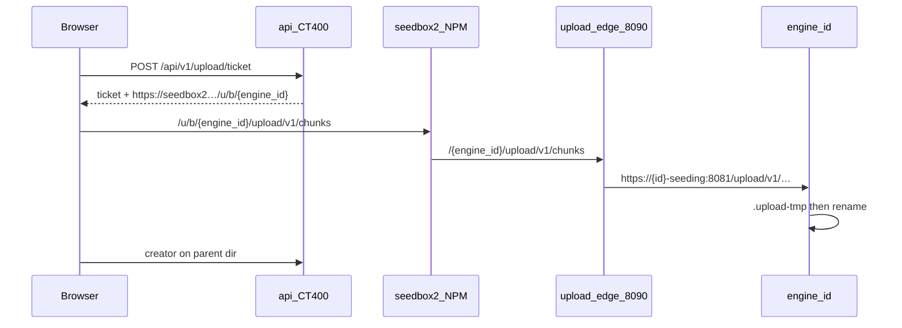

# Загрузка файлов в RelaySeed

> Прод-схема: `/upload/v1` **вшит в каждый движок**. На data-host стоит тонкий
> `upload-edge` (nginx :8090). Python-sidecar `seeding-upload` — только откат.
>
> **Выкат на прод:** пошаговый runbook — [`UPDATE-UPLOAD-EMBED.md`](UPDATE-UPLOAD-EMBED.md).

## Решения

| Тема | Решение |
|------|---------|
| UX | Меню «Файл» (загрузка + попап очереди), отдельно от «Торрент» |
| После заливки | «Создать торрент» на **каталог**; можно отказаться |
| Куда пишем | Том **этого** движка (`/data` / `storage_prefix`) |
| Публичный вход | NPM `/u/b/` → 171:8090, `/u/a/` → 243:8090 (как было) |
| Маршрут до движка | `/{engine_id}/upload/v1/…` (флаг `SEEDING_UPLOAD_PER_ENGINE=1`) |
| Внутренний API | **Не** публикуем. Edge проксирует только `/upload/v1` и `/health` |
| Auth | Короткий HMAC upload-ticket от API; ticket.eng должен совпасть с id движка |
| Релей | Без изменений логики: база + `/{engine_id}` уезжает на seedbox2 `/u/{a\|b}/…` |
| Откат | `SEEDING_UPLOAD_PER_ENGINE=0` + снова sidecar; либо флаг upload off |
| Права | operator+ |
| Размер | чанки + докачка; staging `.upload-tmp` → atomic move |
| Лимиты UI | admin в «Настройки → Лимиты» (`app_settings.upload_limits`); env — дефолт |

## Поток



Почему не через CT400: гигабайты не должны идти лишним хопом через control plane.
Почему не целиком `:8081` наружу: там `/internal/v1` и токен оркестратора.

## Компоненты

| Путь | Назначение |
|------|------------|
| `upload/seeding_upload/` | storage + ticket + **общий** HTTP-роутер |
| `engine/seeding_engine/upload_http.py` | монтирует роутер на движок (один корень) |
| `api/.../upload.py` | ticket + `resolve_upload_base_url` |
| `upload-edge/nginx.conf` | публичный :8090 → `{id}-seeding:8081` |
| `docker-compose.upload-edge.yml` | edge на 171 / 243 |
| `docker-compose.upload.yml` | старый sidecar (откат) |
| `upload-relay/` | полуприёмник на RU VDS |

## Env

```bash
# api (CT400)
SEEDING_UPLOAD_ENABLED=1
SEEDING_UPLOAD_TICKET_SECRET=<shared>
SEEDING_UPLOAD_PER_ENGINE=1
SEEDING_UPLOAD_BASE_URLS={"b1":"https://seedbox2.hw-s.ru/u/b",…,"a1":"https://seedbox2.hw-s.ru/u/a",…}
# при PER_ENGINE=1 к базе дописывается /{engine_id}, если его ещё нет
SEEDING_UPLOAD_RELAY_BASE_URLS={"b1":"https://185-185-143-207.sslip.io/u/b",…}
# дефолты лимитов UI, пока admin ничего не сохранил
SEEDING_UPLOAD_MAX_PARALLEL=4
SEEDING_UPLOAD_CHUNK_CONCURRENCY=4

# engine (каждый)
SEEDING_UPLOAD_TICKET_SECRET=<same>
UPLOAD_CORS_ORIGINS=https://seedbox2.hw-s.ru,https://seedbox.hw-s.ru
UPLOAD_CONTENT_UID=1000
UPLOAD_CONTENT_GID=1000

# upload-relay — без смены upstream: engine id в path
UPLOAD_RELAY_UPSTREAMS={"a":"https://seedbox2.hw-s.ru/u/a","b":"https://seedbox2.hw-s.ru/u/b"}
# Caddy на RU: :8445, только h1/h2 (без HTTP/3). Релей 0.1.1 повторяет обрыв апстрима.
```

После `complete`: файл **`1000:1000` / `0644`**, новые каталоги **`1000:1000` / `0755`**.

## Лимиты (admin)

| Метод | Путь | Кто |
|-------|------|-----|
| GET | `/api/v1/settings/upload` | любой авторизованный |
| POST | `/api/v1/settings/upload` | только **admin** |
| GET | `/api/v1/upload/features` | любой авторизованный (очередь UI) |

Тело: `{ "max_parallel_uploads": 1–8, "chunk_concurrency": 1–8 }`. Пока в БД пусто —
дефолты из `SEEDING_UPLOAD_MAX_PARALLEL` / `SEEDING_UPLOAD_CHUNK_CONCURRENCY` (оба 4).
На HDD (b*) обычно ставят 1 файл и 2–4 чанка.

## Выкат (переход со sidecar)

Точные команды, секрет, смоук и откат — в [`UPDATE-UPLOAD-EMBED.md`](UPDATE-UPLOAD-EMBED.md).
Кратко: секрет в `.env.engine*` → пересборка движков из корня репо → сеть
`seeding-upload` → edge на `:8090` → sidecar `down` → на CT400
`SEEDING_UPLOAD_PER_ENGINE=1` и `scripts/deploy-ct400.sh`. NPM не менять.

Новый движок: секрет в `.env.engine` → `deploy-engine.sh` сам добавит сеть
`seeding-upload`. Edge подхватит `{id}-seeding` по Docker DNS.

## Откат

1. `SEEDING_UPLOAD_PER_ENGINE=0` на api, перезапуск api.
2. Снова `docker compose -f docker-compose.upload.yml … up -d` на data-host.
3. Edge можно остановить (`upload-edge down`), чтобы освободить :8090.
4. Уже залитые файлы не трогаем.
