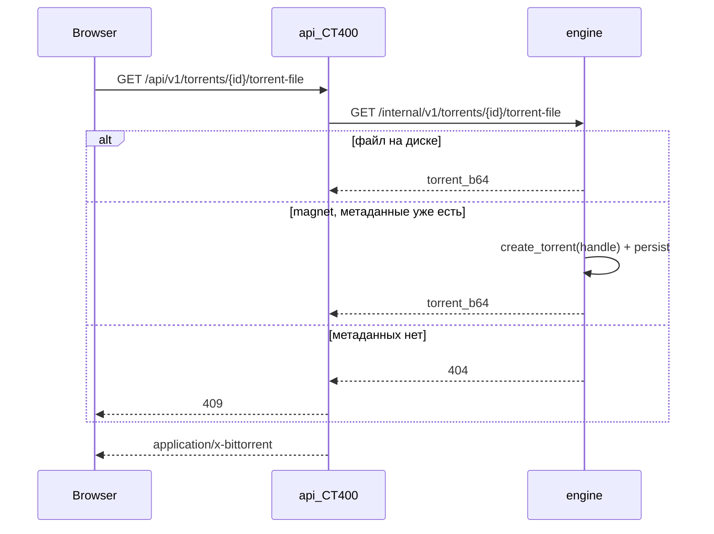

# Скачать `.torrent` раздачи

> Внедрено. web 1.46.0 · api 1.25.0 · engine 1.6.2.
> Это **метаинфо** раздачи (килобайты), не контент с тома.
> Контент файлов: [`FILE_DOWNLOAD.md`](FILE_DOWNLOAD.md).
> Создание нового `.torrent`: [`CREATOR.md`](CREATOR.md).

Кнопка **«Скачать торрент»** в карточке раздачи (рядом с «Переанонс»)
отдаёт тот же `.torrent`, которым движок сидирует и переносит раздачу.

## Решения

| Тема | Решение |
|------|---------|
| Что качаем | `.torrent` этой раздачи, не файлы контента |
| Откуда | Движок: `/data/.torrents/{db_id}.torrent`; если нет — сборка из живого handle |
| Куда идут байты | Через CT400 `api` (файл маленький). Edge / RU-релей не нужны |
| UX | Деталь → тулбар: Пауза · Проверить · Переанонс · **Скачать торрент** · Удалить |
| Публичный маршрут | `GET /api/v1/torrents/{id}/torrent-file` |
| Внутренний | `GET /internal/v1/torrents/{db_id}/torrent-file` → `{torrent_b64}` |
| Имя файла | `display_name` + `.torrent` (`Content-Disposition`, RFC 5987 если не ASCII) |
| Права | GET — viewer+; кнопка в UI — operator+ (весь тулбар карточки) |
| Нет файла | 409: magnet без метаданных или mock-движок |
| Откат | убрать кнопку в `web/src/main.ts`; эндпоинт можно оставить |

## Поток



Почему через CT400, а не через `/u/b/` как файлы контента: `.torrent` — килобайты,
отдельный ticket/релей не окупается. Тот же канал, что «Скачать» в очереди creator.

## Контракт

### API (CT400)

`GET /api/v1/torrents/{id}/torrent-file`

| Код | Когда |
|-----|--------|
| 200 | тело — байты `.torrent`, `Content-Type: application/x-bittorrent` |
| 404 | раздачи нет в БД |
| 409 | на движке нет `.torrent` и нельзя собрать из handle |
| 502 | движок недоступен |

Имя: `attachment; filename="Name.torrent"` или
`filename="download.torrent"; filename*=UTF-8''…` для не-ASCII.

### Движок

`GET /internal/v1/torrents/{db_id}/torrent-file` → `{db_id, torrent_b64}`.

Порядок:

1. Прочитать `/data/.torrents/{db_id}.torrent` (пишется при add по файлу / create / migrate).
2. Если нет — `create_torrent(handle.torrent_file())` + трекеры handle, затем persist.
3. Нет handle или нет `torrent_info` (magnet без метаданных) → 404.
4. Mock-рантайм без `read_torrent_file` → 501, API мапит в 409.

Клиент оркестратора: `EngineClient.get_torrent_file` (тот же метод, что перенос).

## Выкат

Только control plane, если нужны раздачи, у которых `.torrent` уже на диске
(создание, upload, migrate):

```bash
# CT400, pct exec 400
cd /opt/containerd
git fetch origin && git reset --hard origin/main
bash scripts/deploy-ct400.sh up -d --build api web
```

Движки (magnet без сохранённого файла → сборка из handle) — engine 1.6.2
на 171 и 243, см. [`DEPLOYMENT_STATE.md`](DEPLOYMENT_STATE.md) §5.

Проверка: карточка любой раздачи → «Скачать торрент» → в загрузках браузера
`.torrent` с названием раздачи; `curl -fI` на `…/torrent-file` → 200.
